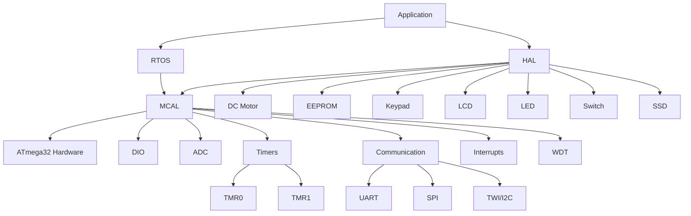
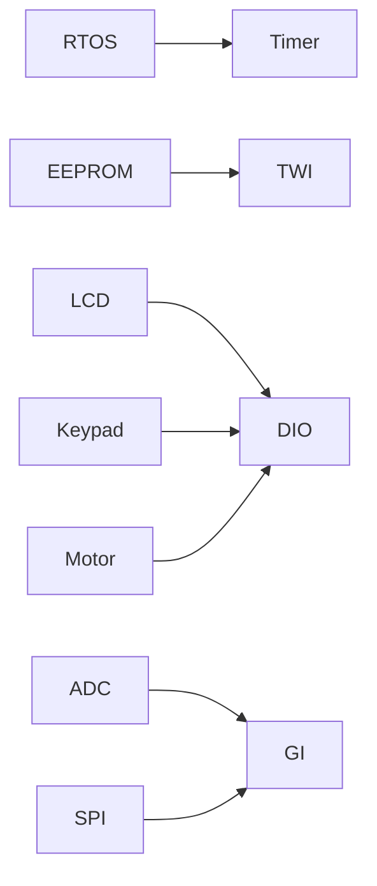

# ATmega32 HAL/MCAL Driver Library

## 📋 Project Overview

A comprehensive Hardware Abstraction Layer (HAL) and Microcontroller Abstraction Layer (MCAL) for ATmega32 microcontroller with Real-Time Operating System (RTOS) support.

## 🏗️ System Architecture



## 📁 Driver Modules Summary

### 🎯 MCAL (Microcontroller Abstraction Layer)

| Module | Description | Key Features |
|--------|-------------|--------------|
| **DIO** | Digital Input/Output | Pin/Port control, Toggle, Pull-up |
| **ADC** | Analog-to-Digital | 8 channels, 10-bit resolution |
| **Timers** | Timer/Counter | PWM, CTC, Overflow modes |
| **UART** | Serial Communication | 9600 baud, Async mode |
| **SPI** | Serial Peripheral Interface | Master/Slave modes |
| **TWI** | I2C Communication | Master/Slave, EEPROM support |
| **EXTINT** | External Interrupts | INT0, INT1, INT2 with edge detection |
| **GI** | Global Interrupt | System interrupt control |
| **WDT** | Watchdog Timer | System recovery |

### 🎨 HAL (Hardware Abstraction Layer)

| Module | Description | Key Features |
|--------|-------------|--------------|
| **DC Motor** | Motor control | Bidirectional, Enable/Disable |
| **LCD** | Character Display | 4-bit mode, Custom characters |
| **Keypad** | Matrix Keypad | 4x4 scanning, Debouncing |
| **EEPROM** | External Memory | I2C interface, Read/Write |
| **LED** | Light Control | ON/OFF/Toggle |
| **Switch** | Button Input | State detection |
| **SSD** | 7-Segment Display | Number display |

### ⚡ Real-Time Operating System

| Feature | Description |
|---------|-------------|
| **Task Management** | Create, Suspend, Resume, Kill tasks |
| **Scheduling** | Preemptive scheduling with priorities |
| **Timer-based** | Uses Timer0 CTC for tick generation |
| **Configurable** | Up to 3 tasks (configurable) |

## 🔧 Key Configuration Examples

### Timer Configuration
```c
#define TIMER_0_MODE TIMER_0_FAST_PWM
#define PRELOAD_OVERFLOW_VALUE 112
```

### RTOS Configuration
```c
#define RTOS_TASK_NUMBER 3
```

### Communication Setup
```c
// UART: 9600 baud, 8-bit, No parity
// SPI: Master mode, 250kHz
// TWI: 400kHz, ACK enabled
```

## 🚀 Quick Start Examples

### RTOS Task Creation
```c
void Task1(void) { /* Your code */ }
void Task2(void) { /* Your code */ }

RTOS_CreateTask(1000, 0, Task1);  // 1s period, priority 0
RTOS_CreateTask(500, 1, Task2);   // 500ms period, priority 1
RTOS_Start();
```

### Peripheral Control
```c
// Motor control
DCM_init(DCM_ENA);
DCM_direction(DCM_CLOCK_WISE, DCM_ENA);

// LCD display
LCD_init();
LCD_sendword("Hello RTOS!");

// ADC reading
u16 sensor_value;
ADC_getdigitalvalue(ADC_CHANNEL0, &sensor_value);
```

### Communication
```c
// UART transmission
UART_Txchar('A');

// EEPROM operations
EEPROM_WriteData(0x100, data);
EEPROM_ReadData(0x100, &read_data);
```

## 📊 Performance Characteristics

| Module | Resolution/Speed | Features |
|--------|-----------------|----------|
| **ADC** | 10-bit, ~50kHz | 8 channels, AVCC reference |
| **PWM** | 8-bit (Timer0) | Fast PWM, Phase Correct |
| **UART** | Up to 115200 | Async, 8-bit data |
| **SPI** | Up to 1MHz | Master/Slave modes |
| **TWI** | 400kHz standard | 7-bit addressing |

## 🔄 Inter-module Dependencies



## 🛠️ Build Information

- **Compiler**: AVR-GCC
- **MCU**: ATmega32
- **Clock**: 16MHz
- **Libraries**: AVR Libc

## 👨‍💻 Author

**Mario Emad Boles**  
*Version: 2.0*  
*Complete HAL/MCAL/RTOS Solution for ATmega32*

---

*This library provides a robust foundation for embedded applications with clean hardware abstraction and real-time task management capabilities.*
